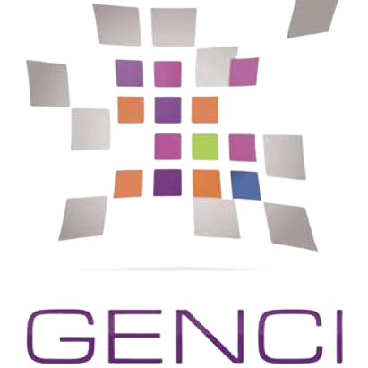

# HSF - Documentation

    
     
    <b>Hippocampal</b> <i>Segmentation</i> Factory
     
    <b>Current HSF version:</b> 1.2.2 
    <b>Built-in Models version:</b> 4.0.0 
    <b>Models in the Hub:</b> 4

____

    <i>Propulsed by</i>
     
    
    
    
    
    
    
    
    
    

____

 

| Package                                                                                                                                                                                                                                               | Code Quality                                                                                                                                                                                                                                                                                                                                                                                                                                                                                                                                                                                                                                                                                    | Misc                                                                                                                                                                                                                                                |
| ----------------------------------------------------------------------------------------------------------------------------------------------------------------------------------------------------------------------------------------------------- | ----------------------------------------------------------------------------------------------------------------------------------------------------------------------------------------------------------------------------------------------------------------------------------------------------------------------------------------------------------------------------------------------------------------------------------------------------------------------------------------------------------------------------------------------------------------------------------------------------------------------------------------------------------------------------------------------- | --------------------------------------------------------------------------------------------------------------------------------------------------------------------------------------------------------------------------------------------------- |
|    |    |   |

The Hippocampal Segmentation Factory (HSF) is a Python package for
the segmentation of the hippocampal subfields in raw MRI volumes.

## Purpose & Use Cases

The main idea is to have a click-button tool that allows the user to
segment the hippocampal subfields in a given raw image (T1w or T2w), while keeping
as much modularity and customization options as possible.

HSF will be able to segment the following subfields:

- Dentate gyrus (DG),
- Cornu Ammonis (CA1, CA2 & CA3) in a flexible way (e.g. you can ask to combine CA2 and CA3),
- Subiculum (SUB).

HSF will segment the hippocampus from head to tail: it will produce
an homogeneous segmentation from the anterior hippocampus (head), to
the posterior hippocampus (tail), without assigning a specific head
or tail class.

HSF results from a collaborative effort:

1. We are continuously working on improving the segmentation of the subfields,
   mainly by adding new manually segmented MRIs (feel free to send us yours if you can, thanks!)
2. HSF proposes a "Model Hub", meaning that anyone can distribute their own ONNX segmentation
   model. Just send us a small `*.yaml` config file, and the end-user will effortlessly be able to
   use HSF with your model.

Please note that the tool is still under development and is not yet
ready for production use. It uses multiple expert deep learning models
trained on 600+ manually segmented hippocampi (see the [F.A.Q. section](faq.md))
which are not yet fully polished.

## Technical Features

HSF uses inference sessions provided by [ONNXRuntime](https://onnxruntime.ai),
which means that it can be used *theoretically* on Windows, MacOS and Linux,
and the following hardware accelerations: CPU, CUDA, DirectML, OneDNN,
OpenVINO, TensorRT, NUPHAR, Vitis AI, ACL, ArmNN, MIGraphX, and Rockchip NPU.
Please be aware that we do not tested all possible configurations, as HSF
has been tested only on CPU and CUDA on Linux (Debian-based and Arch-based distros).

Since v1.0.0, HSF also provides a [DeepSparse backend](https://neuralmagic.com/technology/)
which can be used in conjunction with pruned and int8 quantized models
to deliver a much faster CPU inference speed (see [Hardware Acceleration](user-guide/configuration.md)
section).

Since v1.2.0, the complete training code is available at [hsf_train](https://github.com/clementpoiret/hsf_train).
The `hsf_train` repository also contains easy to use scripts to train OR **finetune your own models**.

____

HSF is distributed under the [MIT license](about/license.md):

| Permissions                                                   | Conditions                                                  | Limitations           |
| ------------------------------------------------------------- | ----------------------------------------------------------- | --------------------- |
| Commercial use Distribution Modification Private use | A copy of the license and copyright notice must be included | Liability Warranty |

!!! note ""
    This work has been partly founded by the Fondation de France.
    HSF has been made possible by the IDRIS/GENCI with the HPE Jean Zay Supercomputer.
    Latest models have been trained with the help of [Scaleway](https://www.scaleway.com/) and [Hugging Face](https://huggingface.co/).

    CEA Saclay | NeuroSpin | UNIACT-Inserm U1141
