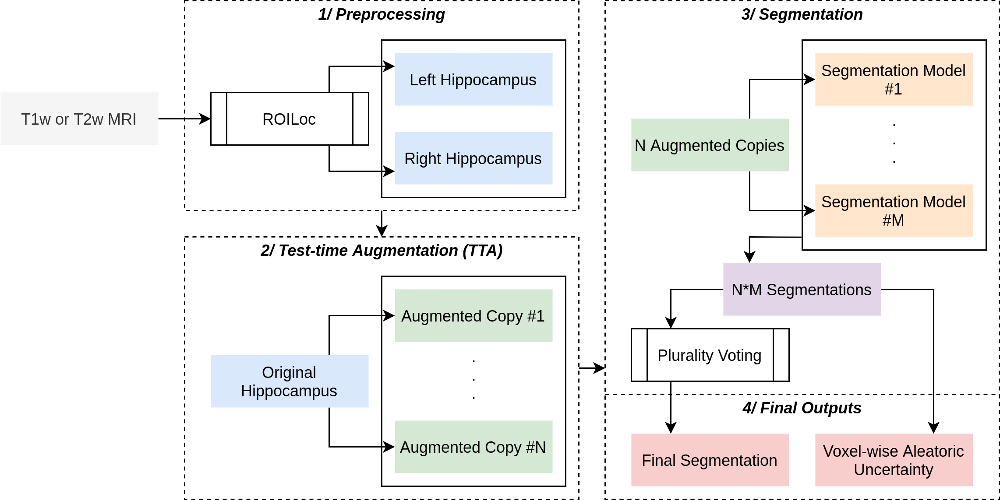
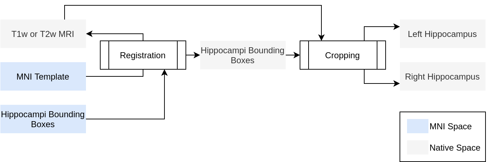

# Summary

Researchers can use their own models

# Statement of Need

The hippocampus plays a major role in specific functions of the brain like the episodic memory, the memory containing specific spatio-temporal details. Divided in hippocampal subfields - namely the Cornu Ammonis, the Dentate Gyrus and the Subiculum - it is actively involved in episodic memory, learning, and decision making. Thus, those substructures are determining an important part of one's behavior during his whole lifespan from the emergence of episofic memory in children to age-dependant cognitive decline. Hippocampal subfields has been shown to be implied in pathological conditions such as Alzheimer's disease, or Temporal lobe epilepsy [@todaRoleAdultHippocampal2019].

Therefore, their exist a need for a precise and accurate delineation of those subfields in order to study both healthy and pathological conditions. This delineation process appears to be challenging as the hippocampus is a small and complex structure. Even manual segmentation, still considered as a gold-standard method, is an error-prone process due to inconsistant guidelines and the need for high-definition MRIs.

To date, there exists (semi-)automated methods for the segmentation of the hippocampal subfields (e.g. @yushkevichAutomatedVolumetryRegional2015, @iglesiasComputationalAtlasHippocampal2015, @romeroHIPSNewHippocampus2017), but they are either slow (e.g.: up to a day to segment a new MRI with `FreeSurfer`) or innacurate, making them unsuited for research or clinical applications. While those methodologies are actually considered as "legacy methods" with respect to the actual literature of semantic segmentation, Deep Learning models have been validated on this complex task [@qiuFeasibilityAutomaticSegmentation2019], but they are still reserved to specific populations of researchers / engineers because either models are not public and need to be reimplemented from scratch (e.g. @zhuDilatedDenseUNet2019), or need to be re-trained because pretrained models are not made available, or because they are trained on a specific and uniform dataset, thus causing generalization issues on images acquired with different acquisition parameters (e.g. resolution, contrast, scanner).

This lack of uniformity and ease of use of hippocampal segmentation models leaves a gap in the range of technical options available to researchers and cliniciants. By developing and published our Hippocampal Segmentation Factory (HSF), we hope to fill this gap and help the scientific community to better study the hippocampal subfields.

# Segmentation Pipeline

The HSF pipeline is constituted of 3 main steps: 1/ a preprocessing step handled by ROILoc to extract the hippocampi from a given MRI, 2/ an augmentation pipeline, and 3/ a segmentation by multiple expert models in order to produce both a segmentation and an uncertainty map (figure \ref{HSF}).

## Hippocampal Localization and Preprocessing

ROILoc, ZNorm, Shape

## Hippocampal Subfields Segmentation

ARUNet, unstructured pruning, SWA, big databases (mix public, private), T1, T2, multi acquisition center, multi res
TTA Bagging

## Postprocessing and Uncertainty Estimation

TTA vote, aleatoric uncertainty

# Acknowledgements

IDRIS Genci

# References
