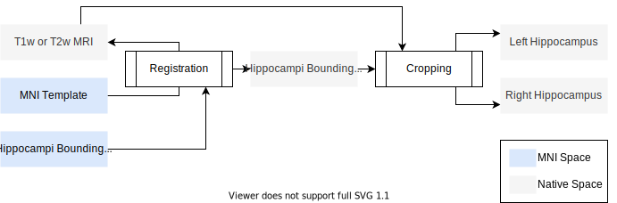

# Configuration

HSF uses [`Hydra`](https://hydra.cc) to manage its configuration.

> Hydra is an open-source Python framework that simplifies the development of research and other complex applications. The key feature is the ability to dynamically create a hierarchical configuration by composition and override it through config files and the command line. The name Hydra comes from its ability to run multiple similar jobs - much like a Hydra with multiple heads.

## How to use Hydra?

HSF is configured using the following config groups:

```
conf
│   config.yaml   
│
└───augmentation
│   │   default.yaml
│   
└───files
│   │   default.yaml
│
└───hardware
│   │   onnxruntime.yaml
│   │   deepsparse.yaml
│
└───multipectrality
│   │   default.yaml
│
└───roiloc
│   │   default_corot2.yaml
│   │   default_t2iso.yaml
│
└───segmentation
    │   single_fast.yaml
    │   single_accurate.yaml
    │   single_sq.yaml
    │   bagging_fast.yaml
    │   bagging_accurate.yaml
    │   bagging_sq.yaml
```

Groups can be selected with `group=option`. For example: `hsf segmentation=bagging_fast`

Each individual option can be overriden, e.g. `hsf roiloc.margin=[16,8,16]`

You can also add specific configs absent from the default yaml files (e.g. `hsf +augmentation.elastic.image_interpolation=sitkBSpline`)

## Configuration details

Every `*.yaml` file defines a set of parameters influencing the segmentation, as detailed below.

### Inputs & Outputs

I/O are managed through the `files.*` arguments. Default parameters are defined in [`conf/files/default.yaml`](https://github.com/clementpoiret/HSF/blob/master/hsf/conf/files/default.yaml).

- `files.path` and `files.pattern` are mandatory arguments and respectively define where to search for MRIs, and how to find them through a `glob()` pattern.
- `files.mask_pattern` defines how to find brain extraction masks for registration purposes (see [ROILoc documentation](user-guide/roiloc.md)).
- `files.output_dir` defines where to store temporary files in a relative subject directory.
- `files.overwrite` defines whether to overwrite existing segmentations.

The following example will recursively search all `*T2w.nii.gz` files in the `~Datasets/MRI/` folder, for search a `*T2w_bet_mask.nii.gz` located next to each T2w images:

```sh
hsf files.path="~/Datasets/MRI/" files.pattern="**/*T2w.nii.gz" files.mask_pattern="*T2w_bet_mask.nii.gz
```

### Multispectral mode

Since v1.1.0, HSF supports multispectral mode, where the segmentation is defined from a consensus between segmentations from both T1 and T2 images. Default parameters are defined in [`conf/multispectrality/default.yaml`](https://github.com/clementpoiret/HSF/blob/master/hsf/conf/multispectrality/default.yaml).

- `pattern` defines how to find the alternative contrast of the subject.
- `same_space` defines whether the alternative contrast is already in the same space as the main one. If not, a registration will be performed with the `registration.*` arguments.
- `registration` are the parameters given to [`ants.registration`](https://antspy.readthedocs.io/en/latest/registration.html), such as `type_of_transform`.

You can use the multispectral mode with the following example. For each T2w MRI, it will search a local T1w MRI in the same folder, then register the T1 to the T2 image using an affine registration (default behavior), using the meansquares metric.

```sh
hsf files.path="~/Datasets/MRI/" files.pattern="**/*T2w.nii.gz" multispectrality.pattern="T1w_hires.nii.gz" multispectrality.same_space=False +multispectrality.registration.aff_metric="meansquares"
```

!!! warning "Multispectral mode may not always be the best choice"
    Because it comes from a consensus between T1 and T2 images, it is highly dependent on the quality of the registration.
    If hippocampi do not overlap well, the consensus will be biased.

    A good choice might be to manually register the images, perform a quality check, then use the multispectral mode while passing `same_space=True`.

### Preprocessing pipeline

The preprocessing pipeline is kept as minimal as possible.

First, it is cropped according to the following pipeline using [`ROILoc`](roiloc.md), by registering an MNI template to the image.
As we already know the locations of the hippocampi in the MNI, we can infer the locations of the hippocampi in the subject's space.

As the process is error-prone / imprecise by construction, we also apply margins and offsets to the bounding boxes.



To customize ROILoc parameters, please refer to its dedicated [`ROILoc` page](roiloc.md).

Each crop is then Z-Normalized, and padded to ensure the shape is a multiple of 8.

### Segmentation Models

Our segmentation models need to be downloaded prior to running the HSF pipeline.

By default, they are stored in `~/HSF/models/*`. This folder is set by the argument `segmentation.models_path`.
For example, you can override this path by running:

```sh
hsf segmentation.models_path="/mnt/models/"
```

The models will output segmentations in the format given by `segmentation.ca_mode`:

- `ca_mode=""`: the segmentation is a binary mask of the whole hippocampus,
- `ca_mode="123"`: segmentation in subfields, with merged CA1, CA2 and CA3,
- `ca_mode="1/23"`: segmentation in subfields, with merged CA2 and CA3,
- `ca_mode="1/2/3"`: segmentation in subfields with separate CA1, CA2, and CA3.

In the config files, the models are hardcoded by two parameters: an URL, and an xxHash3_64 hash to ensure the correct model is loaded.
We opted for xxHash bacause it is fast and has a very low collision rate. We removed MD5 checksum because of its known security risks.

If needed, you can even use your own models by running the following example:

```sh
hsf segmentation=single_accurate segmentation.models={"custom_model.onnx":{"url":"https://url.to/your/model.onnx","xxh3_64":"f0f0f0f0f0f0f0f0"}}
```

!!! warning "Note on ONNX models"
    All versions of ONNX Runtime will support ONNX opsets all the way back to (and including) opset version 7.
    To date, ONNX Runtime 1.10.0 supports models with `7 <= opset <= 15`.

    Please also be aware that input sizes aren't fixed. Therefore, please set dynamic dimensions when you export your models.

    For example:

    ```python
    import torch

    model = SegmentationModel()
    model.eval()

    dummy_input = torch.randn(1, 1, 16, 16, 16)
    torch.onnx.export(model,
                      dummy_input,
                      "custom_model.onnx",
                      input_names=["input"],
                      output_names=["output"],
                      dynamic_axes={
                          "input": {
                              0: "batch",
                              2: "x",
                              3: "y",
                              4: "z"
                          },
                          "output": {
                              0: "batch",
                              2: "x",
                              3: "y",
                              4: "z"
                          }
                      },
                      opset_version=13)
    ```

### Test-time Augmentation

Test-time augmentation (TTA) is performed by segmenting multiple altered versions of the input image.

Handled by [`Torch.IO Augmentation`](https://torchio.readthedocs.io/transforms/augmentation.html), the input images
are augmented by random affine transformations (rotation, translation, scale), flips, and elastic distortions.
Each augmented version is segmented, then reverted to the original space. The final segmentation is simply a
[plurality vote](https://www.wikiwand.com/en/Plurality_(voting)) of the segmentations.

By default, the TTA is configured in the file `conf/augmentation/default.yaml` as follows:

```yaml
flip:
  axes: ["LR"]
  flip_probability: 0.5

affine_probability: 0.8
affine:
  scales: 0.2
  degrees: 15
  translation: 3
  isotropic: False

elastic_probability: 0.20
elastic:
  num_control_points: 4
  max_displacement: 4
  locked_borders: 0
```

You can configure individual transformations according to Torch.IO's documentation:

- [`Random Flip`](https://torchio.readthedocs.io/transforms/augmentation.html#randomflip),
- [`Random Affine`](https://torchio.readthedocs.io/transforms/augmentation.html#randomaffine),
- [`Random Elastic Deformation`](https://torchio.readthedocs.io/transforms/augmentation.html#randomelasticdeformation).

### Hardware Acceleration

HSF's Inference Engines can use multiple backends: [`ONNXRuntime`](https://onnxruntime.ai) and [`DeepSparse`](https://neuralmagic.com/) (since `v1.0.0`).

#### ONNXRuntime

`ONNXRuntime` is the default backend and supports almost all major execution providers (e.g. `OpenVINO`, `DirectML` or `CUDA`).
Please check ONNXRuntime's documentation on [Execution Providers](https://onnxruntime.ai/docs/execution-providers) for more information.

Since `v0.1.2`, HSF allows the customization of execution providers through `hardware.engine_settings.execution_providers`,
taking a list of execution providers in order of decreasing precedance.

Here is the default execution:

```sh
hsf hardware.engine_settings.execution_providers=["CUDAExecutionProvider","CPUExecutionProvider"]
```

By default, if a provider isn't available, the next one will be used.
As an example, to force the use of your CPU, you can do:

```sh
hsf hardware.engine_settings.execution_providers=["CPUExecutionProvider"]
```

You can also specify provider options by providing a `List[str, dict]` instead of
a single `str` as in the following example:

```sh
hsf hardware.engine_settings.execution_providers=[["CUDAExecutionProvider",{"device_id":0,"gpu_mem_limit":2147483648}],"CPUExecutionProvider"]
```

#### DeepSparse

Since `v1.0.0`, HSF supports [`DeepSparse`](https://neuralmagic.com/) as a backend. It allows GPU-class speed on CPU thanks
to pruned and int8 quantized models.

To provide such a speedup, your CPU needs to have specific vector instructions sets (AVX2, AVX512, AVX512-VNNI).

Currently, DeepSparse's optimizations are limited to the following CPUs (taken from [GitHub](https://github.com/neuralmagic/deepsparse)):

|                                      x86 Extension                                       |                                                                                                                                                 Microarchitectures                                                                                                                                                 | Activation Sparsity | Kernel Sparsity | Sparse Quantization |
| :--------------------------------------------------------------------------------------: | :----------------------------------------------------------------------------------------------------------------------------------------------------------------------------------------------------------------------------------------------------------------------------------------------------------------: | :-----------------: | :-------------: | :-----------------: |
|   [AMD AVX2](https://en.wikipedia.org/wiki/Advanced_Vector_Extensions#CPUs_with_AVX2)    |                                                                                                             [Zen 2](https://en.wikipedia.org/wiki/Zen_2), [Zen 3](https://en.wikipedia.org/wiki/Zen_3)                                                                                                             |    not supported    |    optimized    |    not supported    |
|  [Intel AVX2](https://en.wikipedia.org/wiki/Advanced_Vector_Extensions#CPUs_with_AVX2)   |                                                                           [Haswell](<https://en.wikipedia.org/wiki/Haswell_(microarchitecture)>), [Broadwell](<https://en.wikipedia.org/wiki/Broadwell_(microarchitecture)>), and newer                                                                            |    not supported    |    optimized    |    not supported    |
|         [Intel AVX-512](https://en.wikipedia.org/wiki/AVX-512#CPUs_with_AVX-512)         |                                                                         [Skylake](<https://en.wikipedia.org/wiki/Skylake_(microarchitecture)>), [Cannon Lake](<https://en.wikipedia.org/wiki/Cannon_Lake_(microarchitecture)>), and newer                                                                          |      optimized      |    optimized    |      emulated       |
| [Intel AVX-512](https://en.wikipedia.org/wiki/AVX-512#CPUs_with_AVX-512) VNNI (DL Boost) | [Cascade Lake](<https://en.wikipedia.org/wiki/Cascade_Lake_(microarchitecture)>), [Ice Lake](<https://en.wikipedia.org/wiki/Ice_Lake_(microprocessor)>), [Cooper Lake](<https://en.wikipedia.org/wiki/Cooper_Lake_(microarchitecture)>), [Tiger Lake](<https://en.wikipedia.org/wiki/Tiger_Lake_(microprocessor)>) |      optimized      |    optimized    |      optimized      |

In order to check if it is worth trying to use DeepSparse, you can run the following command:

```sh
deepsparse_support
```

This command will return 4 possible states:

- `not supported`: Your CPU doesn't have any relevant instruction set. HSF is likely to run very slow,
- `minimal`: Your CPU has the `AVX2` instruction set, meaning you can benefit from Kernel Sparsity,
- `partial`: Your CPU has the `AVX512` instruction set, meaning you can benefit from Activation and Kernel Sparsity,
- `full`: Your CPU has the `AVX512-VNNI` instruction set, meaning you can benefit from Activation and Kernel Sparsity, plus Sparse Quantization.

To switch to the DeepSparse backend, you can simply run:

```sh
hsf hardware=deepsparse
```

!!! tip "Specific Models for DeepSparse"
    To benefit from DeepSparse's optimizations, ***you have to use specific models***.
    For example, models can be pruned (e.g. weights are removed to obtain an optimal sub-model),
    or Quantized (e.g. weights, biases and activations are quantized to 8-bit).

Since HSF v1.1.0, we provide sparsified and quantized models. Therefore, to fully benefit from
DeepSparse, you can our sparsified bootstrapped models trained with Quantization Aware Training (QAT):

```sh
hsf hardware=deepsparse segmentation=bagging_sq
```
